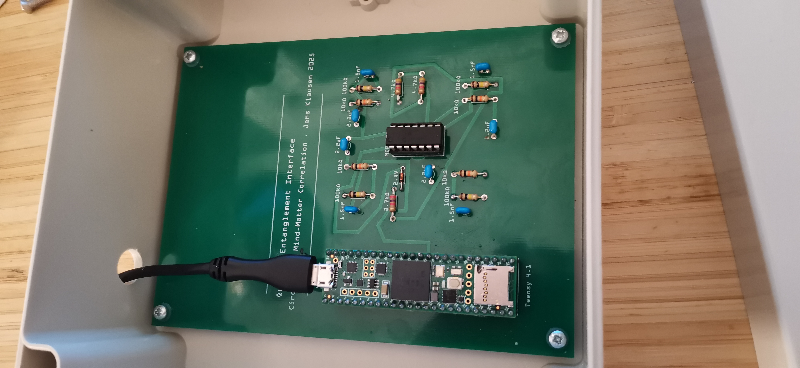
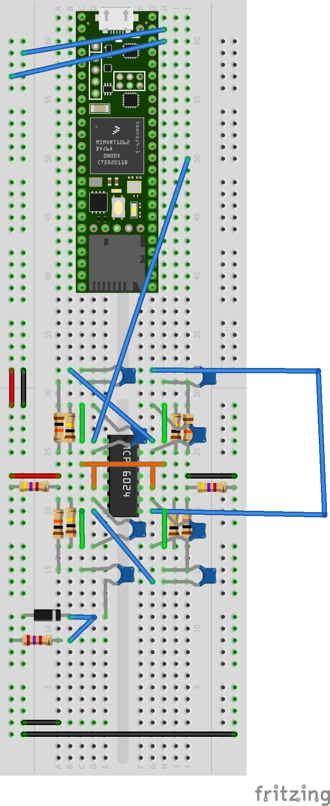
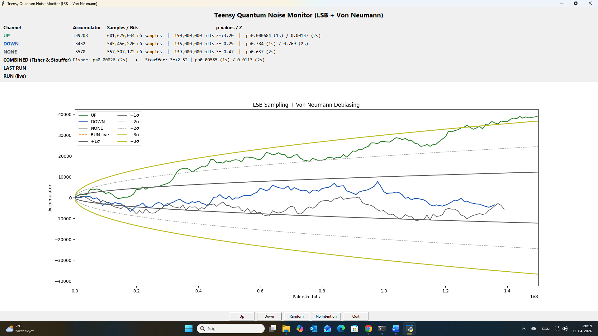

## 📌 Inspiration

This project is inspired by the work of the Princeton Engineering Anomalies Research (PEAR) program.

The following video provides an overview of their experiments and approach:

[](https://www.youtube.com/watch?v=8A6pPLEzkhg)

---

## 🔍 Overview

This project generates analog electronic noise using a zener diode, amplifies the signal, and samples it with a microcontroller.

The sampled signal is converted into a bitstream and analyzed statistically in real time using Python.

The goal is to explore whether directed intention correlates with deviations from expected randomness, inspired by experiments conducted by the Princeton Engineering Anomalies Research (PEAR) lab.

⚠️ This project is exploratory and does **not claim proof** of any effect.

## 🎥 Video Demonstration

A short video showing a live run of the system:

👉 https://youtu.be/2O-MlB6RiJg

The video demonstrates:

- Real-time data acquisition from the hardware  
- Live accumulator behavior (UP / DOWN / NONE)  
- Statistical evolution during a run  

This provides a visual reference for how the system operates in practice.

---

## ⚙️ How It Works

## 🔌 Hardware Setup

The noise source is based on a reverse-biased zener diode, amplified and sampled by a Teensy 4.1.

---

### 🔹 PCB Implementation



The PCB provides a stable and low-noise implementation of the analog front-end, reducing interference and improving reproducibility.

---

### 🔹 Breadboard Prototype (Development)



Initial prototyping was performed on a breadboard. While flexible, this setup is more sensitive to noise and connection instability.

---

### Key components:

- Zener diode (noise source)  
- Multi-stage amplification (~10,000× gain)  
- Teensy 4.1 (12-bit ADC)  

---

### Notes

- The signal is extremely small before amplification  
- Physical layout significantly affects noise characteristics  
- Shielding and grounding are important for stable measurements   

### Sampling

- ~15,000 samples per second  
- 12-bit resolution (0–4095)  

### Bit Generation

- Least Significant Bit (LSB) extraction  
- Von Neumann debiasing  
  - 00 / 11 → discarded  
  - 01 → 0  
  - 10 → 1  

### Channels

- **UP** → intention to increase accumulator  
- **DOWN** → intention to decrease accumulator  
- **NONE** → control (no intention)

---

## 📊 Example Results

This section shows selected visualizations from experimental runs.  
All plots are generated directly from recorded data and can be reproduced from the file in the `/data/logs` folder.

---

### 🔹 Combined Histograms (UP / DOWN / NONE)


Histograms of run results for the three experimental conditions:

- **UP** – intention to increase the accumulator  
- **DOWN** – intention to decrease the accumulator  
- **NONE** – no intention (control condition)

Each histogram shows:

- Distribution of run results  
- Empirical mean  
- Empirical standard deviation (σ)  
- Theoretical σ (≈ 1000)  
- Reference lines for ±1σ, ±2σ, ±3σ  

**Observations:**

- Distributions are approximately normal  
- Means are close to zero  
- Empirical σ is close to theoretical values  

---

### 🔹 All Runs Histogram


Combined distribution across all runs:

- n = 422  
- Mean ≈ 69.1  
- Empirical σ ≈ 1035  
- Theoretical σ ≈ 1000  

The distribution is consistent with expected statistical behavior and shows no strong global bias.

---

### 🔹 Aggregated Accumulator Behavior (LSB + Von Neumann)



This plot shows the cumulative accumulator behavior across multiple runs.

The curves represent:

- **UP** – intention to increase the accumulator  
- **DOWN** – intention to decrease the accumulator  
- **NONE** – control condition  

Reference lines for ±1σ, ±2σ, and ±3σ indicate expected statistical boundaries.

---

### Observations

- The **UP curve reaches approximately z ≈ +3.2**, indicating a notable cumulative deviation  
- The **DOWN** and **NONE** curves remain close to expected statistical limits  
- Fluctuations occur over time, consistent with stochastic processes  

---

### Interpretation

- A z-score of ~3.2 corresponds to a low-probability event under pure randomness  
- However, this result reflects **accumulated data across runs**, not a single independent trial  
- Proper statistical interpretation requires careful consideration of:
  - independence of runs  
  - multiple testing effects  
  - long-term reproducibility  

---

### Notes

- This visualization aggregates data across runs  
- It should not be interpreted as a single continuous experiment  
- Individual run statistics are available in `/data/logs/`  

---

## 🧪 Experimental Notes

- Individual runs can reach z ≈ 2–3 by chance  
- Statistical interpretation requires many independent runs  
- Von Neumann debiasing reduces bias but lowers bit rate  
- Small mean offsets are expected in finite datasets  

---

## 📁 Project Structure

```
pear-inspired-noise-experiment/
│
├── data/
│   ├── logs/          # Statistical results
│   └── plots/         # Generated plots (histograms, run visuals)
│
├── firmware/          # Teensy 4.1 code (data acquisition)
│
├── hardware/          # Circuit design and hardware documentation
│
├── software/          # Python GUI, processing, and analysis
│
└── README.md
```

---

## 🎯 Purpose

This project aims to:

- Build a transparent, reproducible noise experiment  
- Explore statistical behavior of physical randomness  
- Investigate (without assumption) possible correlations with intention  

---

## ⚠️ Disclaimer

This project is exploratory and should not be interpreted as evidence of causal effects without rigorous statistical validation and independent replication.

---

## 📌 Inspiration

Inspired by the work of the Princeton Engineering Anomalies Research (PEAR) program.

---

## 📬 Contributions

Suggestions, critiques, and replication attempts are welcome.
